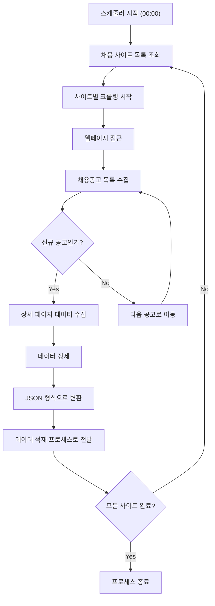
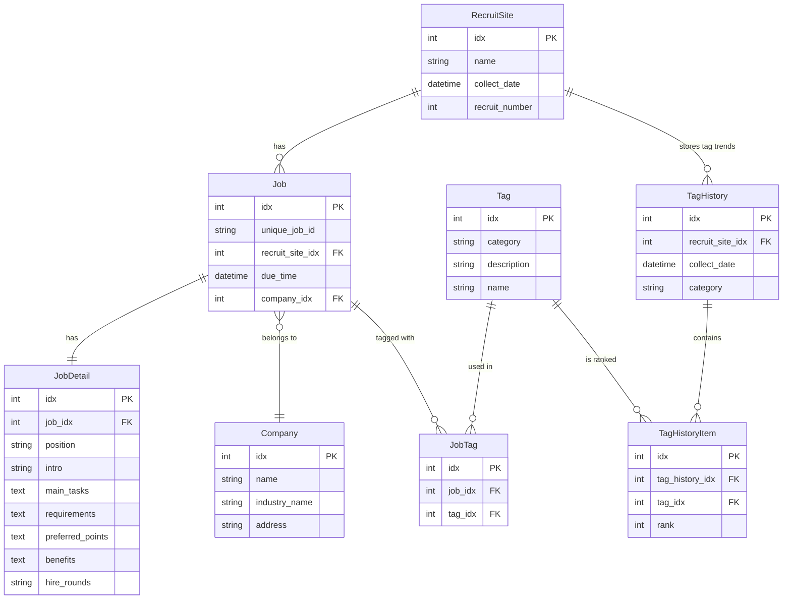

# Side Project Supporter

---

# 개요

개발자로서 성장하기 위해 다양한 아이디어와 기술 스택을 활용한 사이드 프로젝트를

진행하는 것이 필요하다고 생각되었다.

하지만 기존에 사용하던 기술 스택에서 크게 벗어나지 못하고 설계, 구현 단계에서도

새로운 방법을 사용하기보다 이전에 하던대로 생각하는 경우가 많았다.

이에 따라 새로운 요구사항과 기술 스택을 바탕으로 기존에 생각하지 못했던 방향으로

고민하고 경험하는 사이드 프로젝트를 진행 해야겠다 생각하게 되었다.

이때 별도 히스토리 없이 맨땅에서 도출해 내는 것에 어려움을 느껴 사이드 프로젝트 시작에

도움이 될 수 있는 기능을 만들고자 하였다.

---

# 기능

요즘 업계에서 어떤 기능을 만들고 어떤 기술을 사용하는 지에 대해 정보를 얻기 가장 쉬운 곳은

채용 공고라고 생각하였다.

이에 따라 Side Project Supporter는 개발 채용 관련 사이트를 크롤링하여 최근 개발 채용 공고를

수집하고 포맷팅하여 분류한 뒤, DB에 저장하는 기능을 가지는 것이 좋겠다고 생각하였다.

- 채용 사이트 크롤링
- 수집 데이터 포맷팅
- DB 저장

기본 기능은 위와 같이 구성하고 수집한 데이터를 의미있게 사용할 수 있도록 데이터를 분석하고

제안하는 기능을 추가하고자 하였다.

---

# 요구사항

- 매일 채용 사이트를 크롤링하며 개발 채용 정보를 수집한다.
- 채용 사이트를 고정하지 않고, 확장성을 가질 수 있어야 한다.
- 수집하는 정보 중 이상치(outlier)는 구분하고 제외 가능해야한다.
- DB는 분석이 가능하도록 채용 사이트 별 각 분류 값들을 공통 값으로써 저장 가능해야한다.
- 데이터는 직종 별로 구분되어야하며 제공하는 기술 스택과 세부 내용, 우대사항을 포맷팅하여 수집한다.
- 채용공고가 종료된 후 3개월이 지났다면 해당 데이터는 hard delete 한다.
- 수집되는 데이터는 확장과 변경에 자유로워야 한다.
- 수집한 데이터 통계를 응답하는 API를 제공한다.
- 통계 결과는 매일 채용정보 수집 종료 후 DB에 저장한다
- 만약 가능하다면 통계 값을 바탕으로 AI 분석을 제공한다.

---

# 설계

## 1. 크롤링

- 매일 00시 크롤링 스케줄러 프로세스 시작
    - 채용 사이트 이동
    - 사이트 구조에 맞춰 신규(DB에 적재되지 않은) 채용 정보 수집
    - 수집된 데이터를 json 형태로 변경
    - 데이터 적재 프로세스로 json 전달

### 플로우 차트



### json format

```json
{
  "recruitSite": "채용 사이트 A",
  "collectDate": "2025-01-01 00:00:00",
  "recruitNumber": 1234,
  "job": {
    "dueTime": "2025-01-31",
    "detail": {
      "position": "백엔드 개발자",
      "intro": "국내 유망 스타트업으로, 데이터 중심의 혁신적인 서비스를 제공합니다. 다양한 비즈니스 요구를 해결하기 위한 기술력을 함께 키워갈 팀원을 찾고 있습니다.",
      "mainTasks": "• 신규 서비스 개발 및 유지보수\n• 기존 시스템의 성능 최적화 및 리팩토링\n• 데이터 기반 의사결정을 위한 내부 툴 개발\n• MSA 아키텍처 도입과 확장성 설계",
      "requirements": "• 3년 이상의 백엔드 개발 경험\n• Java 또는 Kotlin을 활용한 프로젝트 경험\n• REST API 및 데이터베이스 설계 경험",
      "preferredPoints": "• 대규모 트래픽 처리 경험\n• 클라우드 플랫폼(AWS, GCP) 활용 경험\n• 테스트 주도 개발(TDD) 경험",
      "benefits": "• 스톡옵션 제공\n• 자기계발비 지원\n• 원격 근무 가능\n• 최신 개발 장비 제공",
      "hireRounds": "서류 전형 - 기술 테스트 - 인터뷰"
    },
    "company": {
      "name": "테크 이노베이션",
      "industryName": "IT/소프트웨어",
      "address": "서울특별시 강남구 테크로 123"
    },
    "tag": ["개발", "백엔드 개발자", "Node.js", "Java", "Kotlin", "AWS"]
    }
}
```

## 2. 데이터 적재

- 전달 받은 json 데이터를 DB 구조에 맞게 변환하여 batch save
- RecruitSite : save if not exist / return pk id
- Job.unique_job_id : 중복 채용공고 저장을 방지하기 위하여 RecruitSite 별 구분값 저장
- Tag : save if not exist / return pk id

### **ERD**



## 3. 데이터 통계 API

- 수집한 기술 Tag, collect_date, due_time, requirements 등을 기반으로 데이터 조회 후
  application 단에서 통계 결과 응답
- 기술스택을 의미하는 TagHistory는 매일 크롤링 종료 후 저장하여 기술 스택 동향 분석에 사용한다.
- todo : 추가 요구사항에 따라 구현

## 4. 통계 분석 API

- 통계 API를 통해 정리된 결과를 AI를 활용하여 분석 내용을 응답으로 제공
- todo : 추가 요구사항에 따라 구현

---

# 기술 스택

- Java 21
- Spring boot 3
- Oracle DB
- Docker
- Oracle cloud
- git
- gitHub action

---

# 수집 대상 사이트

## 채용 공고

### 1. wanted

### 2. 프로그래머스

### 3. 점핏

### 4. 그룹바이

## 기술 스택 정보

### 1. 코드너리